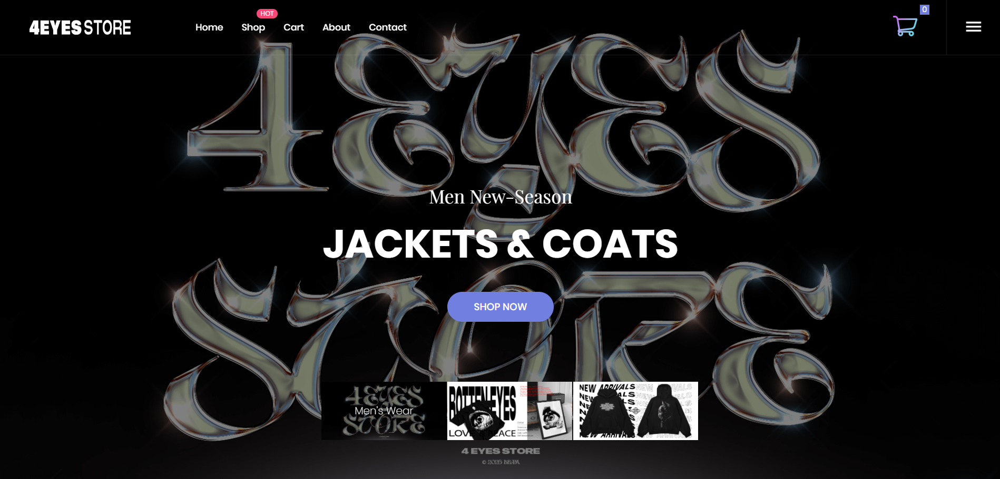

# 4EYES E-Commerce Web Application


A full-stack e-commerce web application for **4EYES** clothing brand, built with CodeIgniter 3 framework. Features include product catalog, shopping cart, checkout system, invoice management, and admin dashboard with reporting capabilities.

---

## 📋 Table of Contents

- [Features](#-features)
- [Tech Stack](#-tech-stack)
- [Screenshots](#-screenshots)
- [Installation](#-installation)
- [Database Setup](#-database-setup)
- [Usage](#-usage)
- [Project Structure](#-project-structure)
- [Contributing](#-contributing)
- [License](#-license)

---

## ✨ Features

### Customer Features

- 🛍️ **Product Catalog** - Browse clothing products (Beanie, Hoodie, T-Shirt, Cargo Shorts)
- 🛒 **Shopping Cart** - Add/remove items, update quantities
- 💳 **Checkout System** - Complete order placement with invoice generation
- 📝 **User Registration** - Create account and login
- 📧 **Email Subscription** - Newsletter subscription via contact form

### Admin Features

- 👥 **User Management** - CRUD operations for user accounts
- 📦 **Product Management** - Add, edit, delete products with image upload
- 📄 **Invoice Management** - View and track all orders
- 📊 **Report Generation** - Export reports to Excel and PDF
- 🔐 **Role-Based Access Control** - Admin and User roles

---

## 🛠️ Tech Stack

| Category            | Technology                           |
| ------------------- | ------------------------------------ |
| **Backend**         | PHP 8.x, CodeIgniter 3               |
| **Database**        | MySQL / MariaDB                      |
| **Frontend**        | HTML5, CSS3, JavaScript, jQuery      |
| **UI Framework**    | Bootstrap                            |
| **Libraries**       | PhpSpreadsheet (Excel), DOMPDF (PDF) |
| **Package Manager** | Composer                             |

---

## 📸 Screenshots

 

---

## 🚀 Installation

### Prerequisites

- PHP >= 7.4 (PHP 8.x recommended)
- MySQL / MariaDB
- Composer
- Apache/Nginx web server (or use XAMPP/Laragon)

### Steps

1. **Clone the repository**

   ```bash
   git clone https://github.com/yourusername/4eyes-ecommerce.git
   cd 4eyes-ecommerce
   ```

2. **Install dependencies**

   ```bash
   composer install
   ```

3. **Configure the application**

   Edit `application/config/config.php`:

   ```php
   $config['base_url'] = 'http://localhost/4eyes-ecommerce/';
   ```

4. **Configure database connection**

   Edit `application/config/database.php`:

   ```php
   $db['default'] = array(
       'hostname' => 'localhost',
       'username' => 'root',
       'password' => '',
       'database' => 'db_pos',
       // ... other settings
   );
   ```

5. **Start the server**
   - If using XAMPP: Move project to `htdocs` folder and start Apache & MySQL
   - If using PHP built-in server:
     ```bash
     php -S localhost:8000
     ```

---

## 🗄️ Database Setup

1. Create a new database named `db_pos`

2. Import the SQL file:

   ```bash
   mysql -u root -p db_pos < db_pos.sql
   ```

   Or use phpMyAdmin to import `db_pos.sql`

### Database Schema

| Table        | Description                       |
| ------------ | --------------------------------- |
| `tb_user`    | User accounts (admin & customers) |
| `product`    | Product catalog                   |
| `tb_invoice` | Order invoices                    |
| `tb_pesanan` | Order items/details               |
| `emails`     | Email subscriptions               |

---

## 📖 Usage

### Default Credentials

| Role  | Username | Password |
| ----- | -------- | -------- |
| Admin | `admin`  | `admin`  |
| User  | `user`   | `user`   |

### Access Points

- **Homepage**: `http://localhost/4eyes-ecommerce/`
- **Login**: `http://localhost/4eyes-ecommerce/auth`
- **Admin Dashboard**: `http://localhost/4eyes-ecommerce/product` (requires admin login)

---

## 📁 Project Structure

```
4EYES/
├── application/
│   ├── config/          # Configuration files
│   ├── controllers/     # Application controllers
│   │   ├── Auth.php           # Authentication
│   │   ├── Product.php        # Product management
│   │   ├── Invoice.php        # Invoice management
│   │   ├── Laporanexcel.php   # Excel report
│   │   └── Laporanpdf.php     # PDF report
│   ├── models/          # Database models
│   │   ├── Product_model.php
│   │   ├── User_model.php
│   │   └── Model_invoice.php
│   └── views/           # View templates
├── assets/
│   ├── css/             # Stylesheets
│   ├── js/              # JavaScript files
│   ├── img/             # Images
│   └── vendor/          # Frontend libraries
├── system/              # CodeIgniter core
├── upload/              # Uploaded files
├── db_pos.sql           # Database dump
├── composer.json        # PHP dependencies
└── index.php            # Application entry point
```

---

## 🤝 Contributing

Contributions are welcome! Please feel free to submit a Pull Request.

1. Fork the repository
2. Create your feature branch (`git checkout -b feature/AmazingFeature`)
3. Commit your changes (`git commit -m 'Add some AmazingFeature'`)
4. Push to the branch (`git push origin feature/AmazingFeature`)
5. Open a Pull Request

---

## 📄 License

This project is licensed under the MIT License - see the [LICENSE](license.txt) file for details.

---

## 👤 Author

**Muhammad Syahru Romadhona**

- GitHub: [@syhru](https://github.com/syhru)

---

## 🙏 Acknowledgments

- [CodeIgniter](https://codeigniter.com/) - PHP Framework
- [Bootstrap](https://getbootstrap.com/) - CSS Framework
- [PhpSpreadsheet](https://phpspreadsheet.readthedocs.io/) - Excel Library
- [DOMPDF](https://github.com/dompdf/dompdf) - PDF Library

---

<p align="center">
  Made with ❤️ for 4EYES Clothing Brand
</p>
